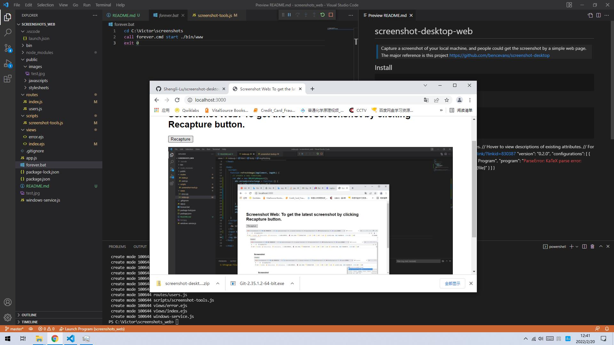

# screenshot-desktop-web

> Capture a screenshot of your local machine, and people could get the screenshot by a simple web page.
  The major reference is this project https://github.com/bencevans/screenshot-desktop
## Install
    $ npm install
## Usage
    npm start

    or you can config your vscode launch.json to run/debug the code
```json
{
    "version": "0.2.0",
    "configurations": [
        {
            "type": "node",
            "request": "launch",
            "name": "Launch Program",
            "program": "${workspaceFolder}\\bin\\www"
        },
        {
            "type": "node",
            "request": "launch",
            "name": "Launch Current Opened File",
            "program": "${file}"
        }
    ]
}
```

## Example
Get the webpage at http://localhost:3000


## Licence

MIT &copy; [Ben Evans](https://bencevans.io)
